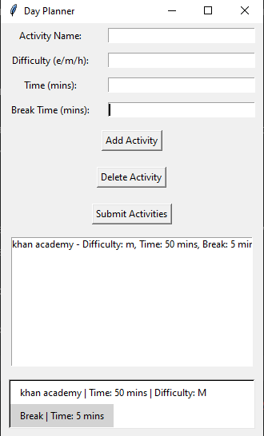

# Day Planner Application

The Day Planner Application is a simple tool built with Python and Tkinter for planning daily activities, tracking their difficulty, time required, and breaks between activities. It allows users to add, delete, submit activities, and view the planned schedule in a user-friendly interface.

## Features

- **Add Activity**: Enter details such as Activity Name, Difficulty (`e` for easy, `m` for medium, `h` for hard), Time (in minutes), and Break Time (in minutes).
  
- **Delete Activity**: Remove activities from the list.
  
- **Submit Activities**: Save the entered activities to a SQLite database for future retrieval.

- **View Schedule**: Displays the scheduled activities and breaks in a formatted view.

## Prerequisites

- Python 3.x
- Tkinter library (usually included with Python installations)
- SQLite3 (for database operations)

## Installation

1. Clone the repository:

   ```bash
   git clone https://github.com/your_username/day-planner.git
   ```

2. Navigate into the project directory:

   ```bash
   cd day-planner
   ```

3. Install dependencies (if any):

   ```bash
   pip install -r requirements.txt
   ```

## Usage

1. Run the application:

   ```bash
   python day_planner_app.py
   ```

2. **Adding Activities**:
   - Enter the Activity Name, select Difficulty (`e`, `m`, or `h`), specify Time (in minutes), and Break Time (in minutes).
   - Click **Add Activity** to add the activity to the list.

3. **Deleting Activities**:
   - Select an activity from the list and click **Delete Activity** to remove it.

4. **Submitting Activities**:
   - Click **Submit Activities** to save all entered activities to the database and clear the current list.

5. **Viewing Schedule**:
   - The schedule will be displayed in the main window after submitting activities. Each activity and its break time will be listed.

## Database

- The application uses SQLite to store activities. The database file `day_planner.db` is created in the project directory to persist data between sessions.

## Screenshots



## Contributing

Contributions are welcome! If you find any issues or have suggestions for improvement, please create an issue or a pull request.

## License

This project is licensed under the MIT License - see the LICENSE file for details.

